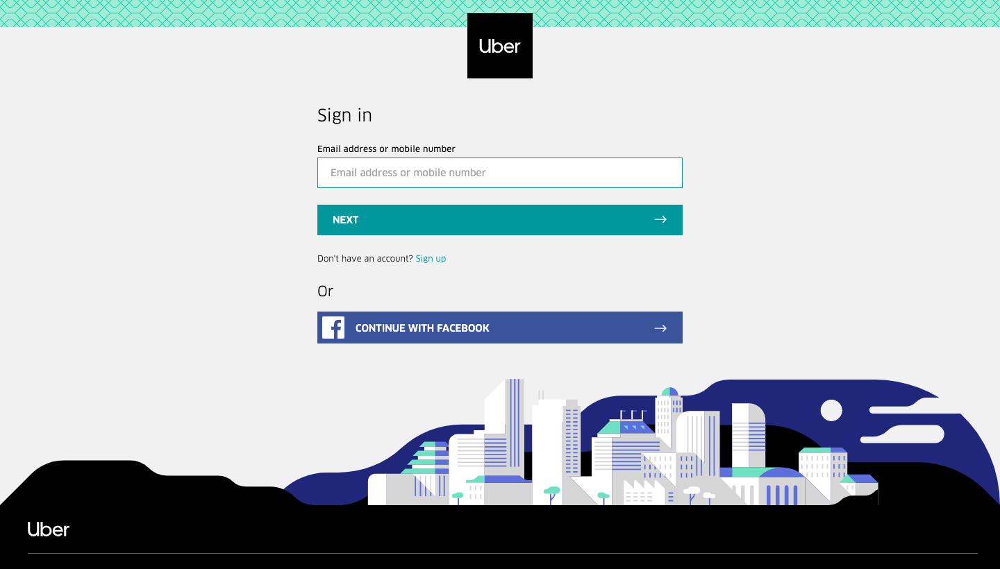

# UberAppProject

## The Task :briefcase:
Uber app that uses their external API. It is built in Python using flask. The job was to create an working development, testing and production environment and to build a pipeline to move the code through them using jenkins. We started by forking the Uber App from the following repo:

https://github.com/uber/Python-Sample-Application

__The Pipeline Solution__
- The Chef tool was used to provide the solution.
- Developed a Python and Nginx cookbook to meet application dependencies which was added to the wrapper cookbook and configured application dependencies by calling a requirements.txt file.
- When the user runs ```Vagrant up``` the application starts running in dev.
- Configured Jenkins to run tests and place on the master branch.
- Packer was used to create an Amazon Machine Image (AMI) image and deploy the application on a Cloud Environment.

The above solution completes the whole CI/CD/CD pipeline. 

__How to install and use__
- Clone this repository using git clone
- Go into the named folder
- Run ```Vagrant Up```
- Go to development.local and you will see the web app.

## Progress :hourglass_flowing_sand:
- Create Nginx cookbook - :white_check_mark:
- Create Python cookbook - :white_check_mark:
- Create Cookbook tests that pass - :white_check_mark:
- Create app project directory - :white_check_mark:
- Configure the Berks Vendor - :white_check_mark:
- Add the chef content to the app and arrange the file structure - :white_check_mark:
- Add the vagrant file and configure it - :white_check_mark:
- Confirm the environment is fully provisioned for the app to run - :white_check_mark:
- Run the machine and make sure the Uber app is reachable - :white_check_mark:
- Create a link between Github & Jenkins - :white_check_mark:
- Create the first Jenkins job that merges to master - :white_check_mark:
- Create working unit tests for the merging job - :white_check_mark:
- Create working integration tests for the merging job - :red_circle:
- Create a second Jenkins job that makes a AMI (Amazon Machine Image) - :white_check_mark:
- Confirm AMI has been made on AWS(Amazon Web Services) - :white_check_mark:
- (Optional Task) Create a AWS instance manually and run the app within the cloud :white_check_mark:
- (Optional Task) Have Jenkins use the new AMI to make a instance - :red_circle:

## How to Install :computer:
- To begin, clone the GitHub repository [HERE](https://github.com/alieubsagnia/DEMO_AWS)
- Navigate into the UberAppProject file and run `berks vendor cookbooks`
- Now run `vagrant up` to start the application.
- Open your internet browser and type [http://development.local](http://development.local)
- If successful you will see this page.



## Further Development :construction:
If you wish to perform updates on the repository follow the below steps.
- Change to the 'dev' branch using `git checkout dev`
- Make the changes
- Then Push to the 'dev' branch using `git push origin dev`
- From here the process is automatic, see below for more information.

## The Pipeline :twisted_rightwards_arrows:
The UberAppProject has a development pipeline.
This is what happens when you make changes and push to the 'dev' branch.
- Push to development branch.
- Jenkins webhook is activated automatically.
- Jenkins then runs the code against the written tests.
- If the code passes then it is automatically merged to master.
- A second Jenkins job is activated on completion of the last.
- Jenkins then interacts with Amazon Web Services and creates a Amazon Machine Image. 
